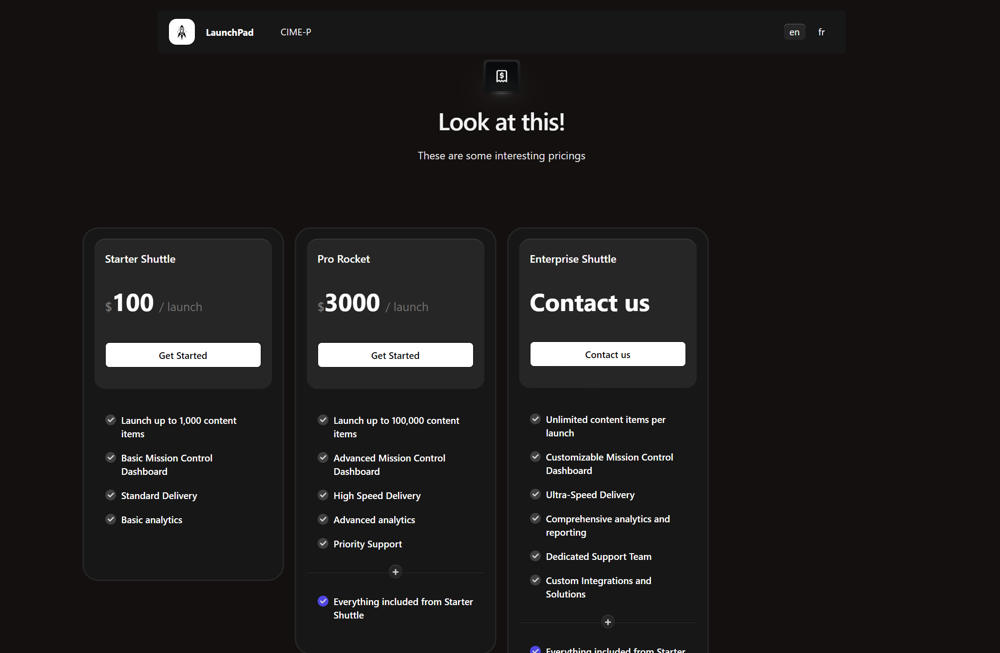

# How to Add a New Page in Strapi (20 steps) 🚀

# Introduction

Welcome to the **ultimate beginner's guide to adding a new page in Strapi!** No coding experience? No problem! By the end of this tutorial, you'll be creating new pages in Strapi like a pro (or at least like someone who knows where the "Create" button is). 🎉

## Goal of the Tutorial

We'll cover step-by-step instructions on how to:

1. Create a new content type in Strapi for your page.
2. Add fields like text, images, and more to your page.
3. Publish your page so it’s ready for the world (or at least your localhost).

## Level of Difficulty

### Beginner-Friendly. 🟢

This tutorial assumes you’ve never used Strapi—or even heard of it. As long as you can click buttons and follow instructions, you’re golden! 🏅

The critical steps are easily understandable and straightforward (you will recognize them with the `⭐️`), ensuring you won't get lost in the process.

## What Do You Need?

- A Computer: Any decent machine will do. If you’re still running Windows 98, maybe it's time for an upgrade. 💻
- A working installation of Strapi (if you need help setting that up, check out [Strapi’s quick start guide](https://strapi.io/documentation/developer-docs/latest/getting-started/quick-start.html)).
- Optional: Snacks and coffee—coding is always better with snacks. ☕🍪

## 📋 How Many Steps?

This tutorial has **20 easy steps**, all designed to take you from “What’s Strapi?” to “Look at my amazing page!”. Actually it's 10 steps, but each step contains detailed sub-steps to ensure you understand each part of the process.

## ⏱️ How Long Will This Take?

Around **10-30 minutes**, depending on how much time you spend celebrating each step.

Are you ready? Let’s jump in and make Strapi do what it does best—simplify your life (and your content management). 🎉

# Let's Begin! 🚀

## Step 1: Log in to Strapi

First, log in through the admin panel to Strapi using you credentials.

## ⭐ Step 2: Create a New Page Entry

1. In the left sidebar, click on **Content Manager**. 📂

2. Select the `Pages` **Collection Type** and Click the **Create new entry** button. 

You are now in the content editor page of Strapi. This is where the magic happens! ✨ You’ll use this tool to define the structure of your new page.

## Step 3: Fill in the fields

1. Fill the input `slug` with the desired name for your amazing page.

## ⭐ Step 4: Add a Dynamic Zone with a Hero Section

1. Scroll to the **Dynamic Zone** area labeled `Page Content`.
2. Click on the **Add Component** button. 

3. From the list of available components, select **Hero Section**.

## Step 5: Define the Content of the Hero Section

1. In the newly added **Hero Section**, fill in the required fields:  
   - **Heading**: Enter an attention-grabbing title. 🎯  
   - **Subheading**: Provide a short description or tagline. 📝 
   - **CTA**: Setup your Call To Action button. 🔘

> 💡 Double-check your inputs to ensure they align with your page's purpose.

2. Define your CTA Button :
    - **URL**: the link of your button. 🔗
    - **text**: the text of your button. 📝
    - **target**: defines how your link will open (_blank, _self, _parent). 🎯
    - **variant**: defines the style of your button (primary, outline, simple). 🎨

---
**target choices**

## Step 6: Add Another Dynamic Zone with a Pricing Section (or whatever you need in your page, this is an example)

1. Back in the **Dynamic Zone**, click **Add Component** again.   
2. Select **Pricing Section** from the list.

## Step 7: Define the Content of the Pricing Section

1. In the **Pricing Section**, configure the following fields:  
   - **Plans**: The plans you want to display in your page. Don't be shy, you can select multiple pricing plans! 💸
   - **Heading**: The title of the pricing section 🏷️
   - **SubHeading**: A quick description or a subtitle. 📝
  

2. Select the pricing tiers you want to display
---
**Plans Options**

## ⭐ Step 8: Add SEO Settings

1. Scroll to the **SEO** section and click on the `+` icon. 

Here there is a lot of things you can do. Don't worry, only 2 are mandatory.

2. Fill in the required fields:  
   - **Meta Title**: Enter a concise and engaging title for search engines. 🔍 
   - **Meta Description**: Write a brief description to entice potential visitors. 📝 

## ⭐️ Step 9: Save and Publish the Page

For now, you can see at the top of your page that your content is a `Draft`. It's because you don't saved it yet.

1. Once all fields are filled out, scroll back to the top and click **Save** to ensure your work is not lost.

> The `Draft` notice should now become `Modified`

2. When you're satisfied with the content, click **Publish** to make the page live.

> Your page should now be published. 🎉

## Step 10: Preview the Page in Next.js

1. Open your Next.js application in your browser.
2. Navigate to the newly created page by using its slug in the URL. For example, if the slug is `newpage`, visit `http://localhost:3000/newpage`.
3. Admire your work! 🎉

# Final Result

**Hero Section**

---
**Pricing Section**

---
**Seo Title**

# Feedback

We hope you found this tutorial helpful and easy to follow. Your feedback is invaluable to us and helps us improve our content. Please take a moment to share your thoughts:

- **What did you like about this tutorial?**
- **Was there anything you found confusing or difficult to follow?**
- **Are there any topics you would like to see covered in future tutorials?**

Feel free to [Contact Me](mailto:sami.kazi-tani@grenoble-inp.fr). Thank you for your time! 🚀